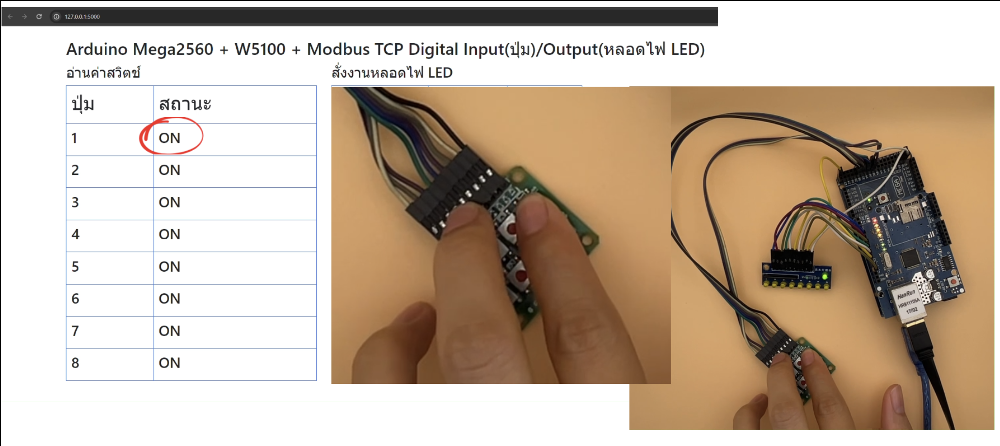
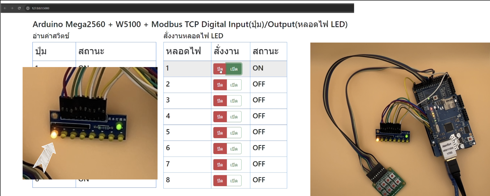

# Web(Flask) กับ Arduino(Mega2560) Modbus(TCP) Digital Input/Output

| รันเว็บด้วยชื่อ app.py |
|----------|
| python -u app.py |

# อุปกรณ์
|  | รายการ | จำนวน |
|----------|----------|----------|
| 1 | Arduino Mega2560| 1 |
| 2 | Switch กดติด ปล่อยดับ 8 bits | 1 |
| 3 | หลอด Led 8 bits | 1 |
| 4 | Ethernet Shield W5100 | 1 |

# Wiring Output LED
| LED Module | Arduino Mega2560 Pin |
|----------|----------|
| 1 | 4 |
| 2 | 5 |
| 3 | 6 |
| 4 | 7 |
| 5 | 8 |
| 6 | 9 |
| 7 | 11 |
| 8 | 12 |

# Wiring Input Switch ปุ่มกด
| Switch Module | Arduino Mega2560 Pin |
|----------|----------|
| 1 | 30 |
| 2 | 31 |
| 3 | 32 |
| 4 | 33 |
| 5 | 34 |
| 6 | 35 |
| 7 | 36 |
| 8 | 37 |

# Modbus (Coil Address) Output LED
| LED Module | Arduino Mega2560 Pin |
|----------|----------|
| 1 | 0 |
| 2 | 1 |
| 3 | 2 |
| 4 | 3 |
| 5 | 4 |
| 6 | 5 |
| 7 | 6 |
| 8 | 7 |

# Modbus (Coil Address) Input Switch ปุ่มกด
| Switch Module | Arduino Mega2560 Pin |
|----------|----------|
| 1 | 10 |
| 2 | 11 |
| 3 | 12 |
| 4 | 13 |
| 5 | 14 |
| 6 | 15 |
| 7 | 16 |
| 8 | 17 |

# Software ที่เกี่ยวข้อง
|  | รายการ | ภาษา |
|----------|----------|----------|
| 1 | VS Code| Python, Javascript, HTML |
| 2 | Arduino IDE 1.8 | C/C++ |

# ไลบรารี่ Python
| ชื่อ | Version |
|----------|----------|
| Flask | 3.0.3 |
| pymodbus | 3.6.8 |
| pyserial | 3.5 |
| pymodbus | 3.6.8 |

# ไลบรารี่ Arduino
| ชื่อ | Version |
|----------|----------|
| ArduinoModbus | 1.0.9 |

## Introduction Video

